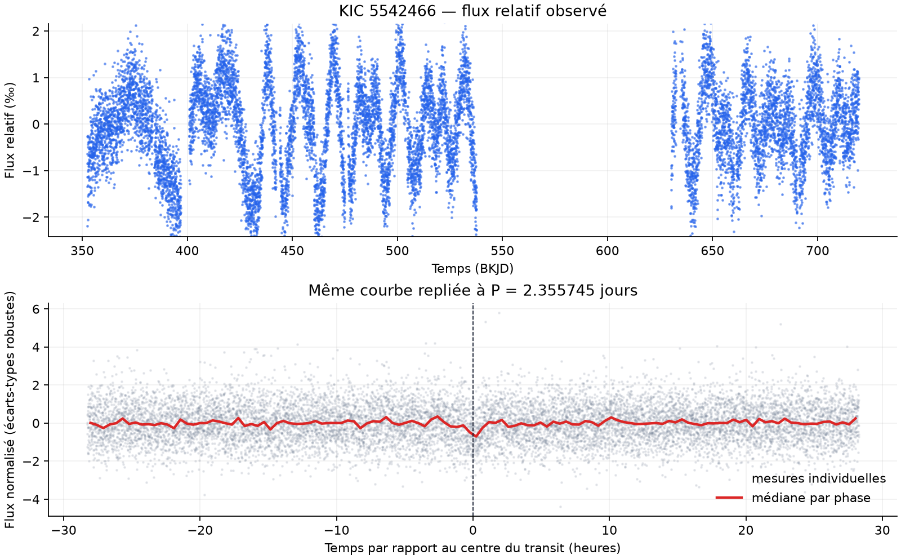

<!-- _class: title -->
<!-- _paginate: false -->

<p class="kicker">TIPE · PHYSIQUE & INFORMATIQUE</p>

# Détecter des exoplanètes dans les données de Kepler

Établir une référence avec le **Box Least Squares**, puis vérifier si un réseau de neurones peut faire mieux sur les mêmes systèmes.

<p class="author">EmileType · Méthode des transits · Kepler DR25</p>

---

## 1. La donnée : une courbe de lumière par étoile

<div class="data-layout">
<div>

Kepler mesure, toutes les **29,4 minutes**, la lumière reçue d’une étoile :

```text
(temps tᵢ, flux Fᵢ)
```

Une planète en transit produit une baisse périodique :

```text
δ = (F₀ − Fₜ) / F₀ ≈ (Rₚ / R★)²
```

Pour chaque système KIC :

- 1 à 3 quarters d’environ 90 jours ;
- colonnes utilisées : `TIME`, `PDCSAP_FLUX`, `SAP_QUALITY` ;
- les trous d’observation sont conservés.

</div>
<div>



<p class="caption">KIC 5542466 · 11 739 mesures valides · P connue = 2,3557 jours. En bas, les orbites sont superposées pour rendre le transit visible.</p>

</div>
</div>

---

## 2. Deux approches à comparer

<div class="method-grid">
<article class="method classical">
  <span class="method-number">A</span>
  <h3>Box Least Squares</h3>
  <p>Recherche explicitement une baisse périodique en forme de boîte.</p>
  <ul>
    <li>modèle physique lisible ;</li>
    <li>peu de paramètres ;</li>
    <li>calcul relativement sobre.</li>
  </ul>
</article>
<article class="method neural">
  <span class="method-number">B</span>
  <h3>Réseau de neurones</h3>
  <p>Apprend les formes utiles directement à partir des courbes.</p>
  <ul>
    <li>modèle plus flexible ;</li>
    <li>entraînement nécessaire ;</li>
    <li>coût et décisions moins lisibles.</li>
  </ul>
</article>
</div>

<p class="question">Le gain de détection justifie-t-il la complexité supplémentaire ?</p>

---

## 3. La référence : Box Least Squares d’Astropy

<div class="bls-steps">
  <div><b>1</b><span><strong>Nettoyer</strong><small>qualité = 0<br>flux fini</small></span></div>
  <i>→</i>
  <div><b>2</b><span><strong>Normaliser</strong><small>médiane par quarter<br>tendance de 2 jours</small></span></div>
  <i>→</i>
  <div><b>3</b><span><strong>Replier</strong><small>100 000 périodes<br>de 0,5 à 30 jours</small></span></div>
  <i>→</i>
  <div><b>4</b><span><strong>Ajuster</strong><small>position, durée<br>et profondeur d’une boîte</small></span></div>
</div>

<div class="equation-card">
  <div>
    <span class="eyebrow">MODÈLE</span>
    <strong>Le meilleur transit minimise</strong>
    <code>RSS = Σ (yᵢ − modèleᵢ)²</code>
  </div>
  <div>
    <span class="eyebrow">DÉCISION</span>
    <strong>Boîte brève plutôt qu’oscillation</strong>
    <code>S = √[max(0, −ΔlogL) / (durée/période)]</code>
  </div>
</div>

<p class="note"><b>Bibliothèque :</b> <code>astropy.timeseries.BoxLeastSquares</code> · seuil choisi hors pli : <b>S ≈ 162,8</b></p>

---

## 4. Résultat BLS et prochaine comparaison

<div class="results-layout">
<div class="confusion">
  <div class="corner"></div><div class="truth">Confirmé</div><div class="truth">Contrôle</div>
  <div class="prediction">BLS positif</div><div class="cell tp"><b>11</b><span>vrais positifs</span></div><div class="cell fp"><b>14</b><span>faux positifs</span></div>
  <div class="prediction">BLS négatif</div><div class="cell fn"><b>31</b><span>faux négatifs</span></div><div class="cell tn"><b>2 944</b><span>vrais négatifs</span></div>
</div>
<div>
  <div class="metric-list">
    <p><b>44,0 %</b><span>précision<br><small>11 bonnes alertes sur 25</small></span></p>
    <p><b>26,2 %</b><span>rappel<br><small>11 systèmes retrouvés sur 42</small></span></p>
    <p><b>32,8 %</b><span>score F1</span></p>
  </div>
</div>
</div>

<div class="next-step">
  <span>ÉTAPE SUIVANTE</span>
  <strong>Entraîner un réseau sur les mêmes KIC et mesurer s’il augmente le rappel sans multiplier les fausses alertes.</strong>
</div>

<p class="sources">Sources : NASA Exoplanet Archive · MAST/Kepler DR25 · Kovács, Zucker & Mazeh (2002) · Astropy BoxLeastSquares</p>
